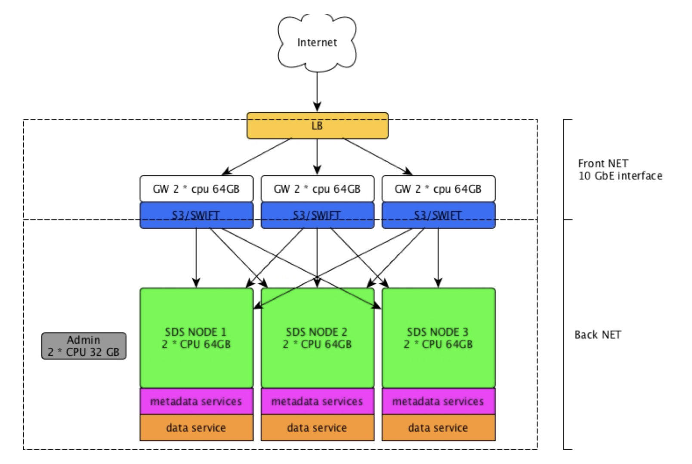
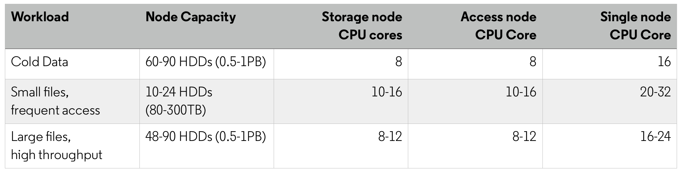
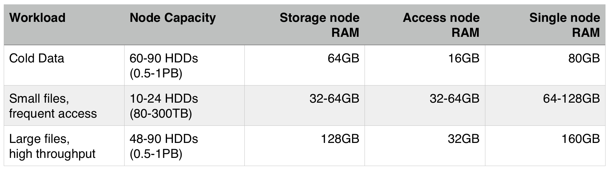

============
Sizing guide
============

Introduction
~~~~~~~~~~~~

OpenIO SDS is a highly flexible solution that allows users to build storage infrastructures that can respond to the most demanding requirements, both in terms of scalability and performance. In this section, we discuss the best practices for configuring an OpenIO cluster on x86 servers depending on use case, performance, and security requirements.

OpenIO SDS is supported on physical and virtual environments, but production clusters are usually deployed on physical nodes, due to the better efficiency and lower costs; this is particularly true for the storage layer. The access layer (S3/Swift services) can be deployed as physical or virtual machines depending on user requirements.

Cluster Layout
~~~~~~~~~~~~~~

There are two types of supported production layouts:

- **Simple configuration**: each node provides front-end and back-end services. This configuration is very easy to deploy, scale, and maintain over time, with each additional node adding resources to the whole cluster. It is suitable for private networks and enterprise use cases, or in any other environment that doesn’t require granular scaling, strong multi-tenancy, or strict security policies. This type of configuration is cost effective for small clusters, but it is less efficient in large scale deployments, and could lead to higher costs over time.

- **Split configuration**: the access layer is separated from the storage layer. This cluster layout is more complex to deploy and maintain, but presents many advantages regarding security and efficiency. By separating the access layer from the rest of the cluster, it is possible to deploy front-end nodes directly on public networks (DMZ) while reducing the attack surface. These services are state-less and have a small number of open TCP/IP ports. Front-end nodes and back-end nodes have different characteristics in terms of CPU, RAM, network, and disk usage, and the separation increases the number of use cases, workloads, and effective multi-tenancy supported by the cluster. This type of configuration also allows the creation of multiple access points to separate traffic from private and public networks. For all the above reasons, this configuration is best suited for large scale deployments, service providers, and any other application where security is a main focus.

A simple cluster in the private network and a front-end layer in the DMZ is also supported.

CPU requirements
~~~~~~~~~~~~~~~~

OpenIO SDS has a lightweight design. It can be installed on a single CPU core with 400MB of RAM, but in production systems the minimum supported CPU has 4 cores. Intel CPUs with ISA-L support are required for erasure coding and compression; otherwise the performance impact is quite severe and a larger number of cores will be needed.

In the storage layer, the number of cores for each node has to be calculated by looking at the expected traffic generated by the node.

Storage layer CPU configuration
~~~~~~~~~~~~~~~~~~~~~~~~~~~~~~~

- For **cold data** and **archiving workloads**, CPU is less important, and a single 8-core CPU node is sufficient for a 90-disk server.

- In uses cases with **small objects**, such as for email storage, a small capacity node (12-24 HDDs) requires 2 10/16-core CPUs.

- For use cases that require **high throughput**, such as video streaming, a medium/large size node (48-90 HDDs) requires 2 8/12 CPU cores.

Front-end access layer
~~~~~~~~~~~~~~~~~~~~~~

This type of nodes requires more CPU and RAM, as erasure coding, data encryption, and all data chunking is usually computed at this level.

- For cold data and archiving workloads, CPU is less important, and a single 8-core CPU node is sufficient.
- In uses cases with small objects, such as for email storage, 2 10/16-core CPUs.
- For use cases that require high throughput, such as video streaming, 2 8/12 CPU cores are required.
- Erasure coding and compression, with ISA-L support, require an additional 10% of CPU power. Without ISA-L, 50% more CPU power is needed.

By adding up CPU cores for the front end and back end, it is easy to find the right amount of cores needed for each node for simple layout configurations.

RAM
~~~

Even though OpenIO SDS can run with a small amount of RAM, any additional resources improve performance because SDS leverages caching mechanisms for data, metadata, and other internal services.

The minimum RAM configuration for any type of cluster node is 8GB, but 16GB is highly recommended. Storage nodes use RAM primarily for caching metadata and data chunks. If the same data and metadata are frequently accessed, more RAM is recommended. Very small objects, less than 1MB in size, benefit the most from large RAM configurations.

Storage layer RAM configuration
~~~~~~~~~~~~~~~~~~~~~~~~~~~~~~~

- For cold data and archiving workloads, large RAM configurations don’t offer any benefit. A large 90-disk server can be configured with 64GB of RAM.
- In uses cases with small objects, such as for email storage, a small capacity node (12-24 HDDs) requires more RAM: 32-64GB is usually the recommended configuration.
- For use cases that require high throughput, such as video streaming, a medium/large capacity node (48-90 HDDs) can take advantage of large caches, and 128GB is recommended.

Frontend access layer:
----------------------

This type of node is CPU and RAM heavy, since erasure coding, data encryption, and all data chunking are usually computed at this level.

- For cold data and archiving workloads, 8GB of RAM is enough in most cases
- In uses cases with small objects, such as for email storage, RAM can bring a huge speed boost, and 32-64GB configurations can increase overall performance.
- For use cases that require high throughput, such as video streaming with large files, large RAM configurations are unnecessary; most of the caching is provided by the storage layer, and 32GB is usually accepted as a standard configuration in most scenarios.

By adding up the RAM needs for the front end and back end, it is easy to find the right amount of RAM needed for each node for simple layout configurations.

RAM configuration examples:
---------------------------

Flash memory
~~~~~~~~~~~~

Flash memory is not mandatory, but it speeds up metadata searching and handling. It is usually recommended to add 0.3% of flash memory capacity to the overall data capacity. This number could be increased to 0.5% when the system is configured for very small files with a large quantity of metadata.

All-flash configurations are fully supported and, in this case, there is no need to separate metadata from data.

Storage Node Capacity
~~~~~~~~~~~~~~~~~~~~~

OpenIO SDS supports node capacities that range from one disk up to the limit of the largest servers available in the market (90-100 disks). The most common disk type used with OpenIO SDS is the 3.5” LFF with SATA interface. Disks with different capacity can be mixed in the same node. SMR (shingled magnetic recording) drives are not currently supported in production environments.

Nodes with different capacities are supported in the same cluster, but CPU/RAM/FLASH/DISK ratios should remain similar to maintain consistent levels of performance.

The net node capacity depends on the data protection schemes applied to the data, and whether it is compressed. As a general rule, format and file system allocation add a 10% overhead to the original disk capacity.

Network
~~~~~~~

Any type of Ethernet network is supported. OpenIO SDS can run on single-port configurations, but this is usually done only for testing and development.

1Gbit/s Ethernet is supported for deep archive solutions, but in all other use cases, 10Gbit/s ports are mandatory. Higher speed networks are also supported.

For production environments, all front-end nodes should be accessible from at least two network paths for redundancy and load balancing. Front-end nodes should be equipped with two additional ports for back-end connectivity to separate north-south traffic and allow the enforcing of stronger security policies.

A private, redundant network for east-west cluster traffic is highly recommended for storage nodes. Access layer nodes access this network through their back-end ports.

In simple layout, with front-end and back-end nodes collapsed, the nodes are connected directly to the network. Even if a single dual-port connection is supported, it is highly recommended to separate front-end and back-end traffic on two separate redundant networks.

An additional, private, 1Gbit/sec network is necessary to connect all the nodes of the cluster for monitoring and management. Hardware management (IPMI or similar protocols), as well as OS and SDS management ports, can all be part of this network.

Load balancing
~~~~~~~~~~~~~~

The front-end access layer its stateless, and doesn’t require any connection persistency or complex load balancing protocols. Supported load balancing solution include HA-Proxy, and third party commercial load balancers with the HTTP protocol enabled.

Admin console configuration
~~~~~~~~~~~~~~~~~~~~~~~~~~~

An administration server is mandatory for production environments. It collects cluster logs, runs analytics, and provides the WebUI dashboard. This server could be physical or virtual, and must be connected to the monitoring and management network of the cluster.

Admin console configuration example:

- 1 x 8-core CPU
- 32GB RAM
- Boot disk
- 200GB SSD storage for storing logs and running analytics jobs

Software requirements
~~~~~~~~~~~~~~~~~~~~~

OpenIO SDS (v.17.04) can be installed on x86 servers compatible with Ubuntu 16.04 and Centos 7.
