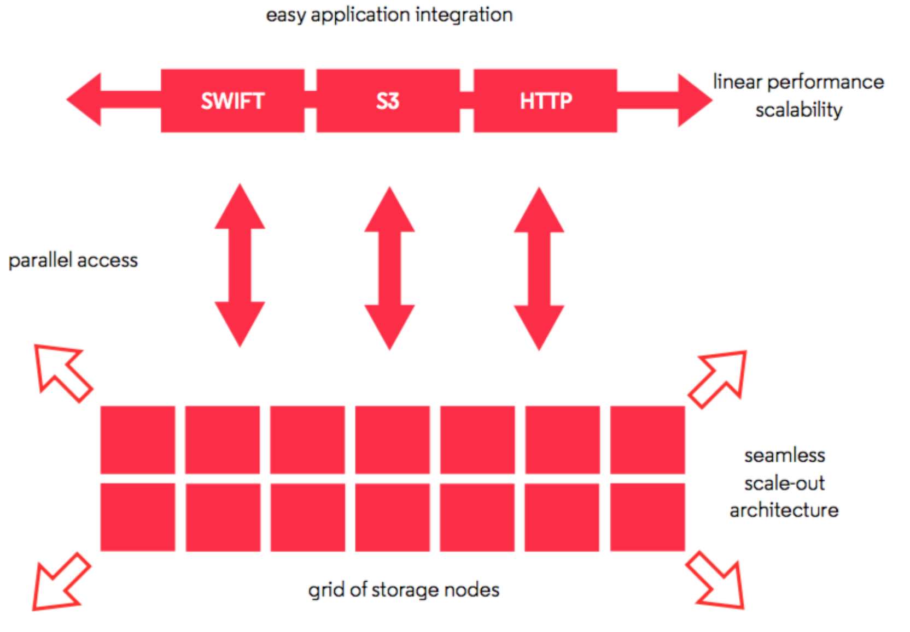
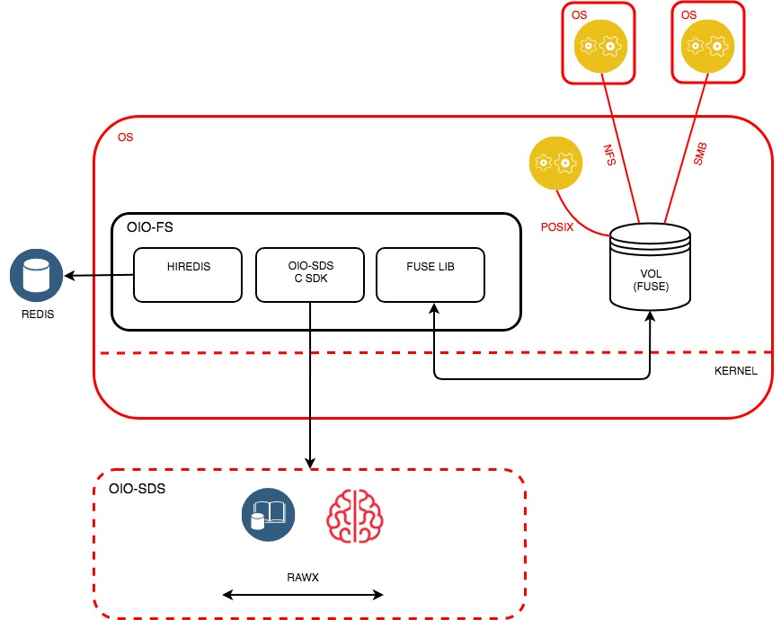

===========
Data Access
===========

S3 API
------
OpenIO SDS is compatible with the Amazon® S3 API.
Amazon S3 is the most common and de facto standard object storage API. With S3 you will be able to manage objects with or without versions, buckets of objects.
Using OpenIO SDS as a backend for Amazon S3 clients, your infrastructure will take advantage of all the gateways and applications already available on the market, on premises, and with all the benefits coming from SDS, including features like the read-after-write consistency that lacks from S3.

TODO : compliancy matrix

Openstack Swift API
-------------------

OpenIO SDS is compatible with the OpenStack® Object Storage REST API.
Application integration becomes easy with this standard REST protocol.
This API can take advantage of many features available in OpenIO SDS without major tradeoffs.

Filesystem
----------

The goal of the OIO-FS connector is to enhance the use of OIO-SDS when used as an object storage backend by providing file-oriented access. It is based on FUSE technology and presents a POSIX file system to users. This access can be used locally, or over a network using NFS or SMB.

Use cases for this include:

•	**Data migration / paradigm shift**: Traditional applications require no changes when used with OIO-FS to ensure backups. Once data is stored on OIO-SDS via OIO-FS, it is immediately available for read-only to cloud-native applications using standard protocols, such Amazon S3 and OpenStack Swift.
•	**File system consolidation**: Thanks to OpenIO SDS’s scalability, multiple file systems can be consolidated in a single object storage backend. This simplifies overall architecture and leads to lower TCO.
•	**Backup directories**: An OIO-FS volume, shared via NFS or SMB, can be easily used as a backup target for applications that do not support standard protocols (S3, Swift).
•	**File sharing**: While OIO-FS was not initially designed to work with standard NAS solutions, it can be used as an efficient and scalable solution for file sharing across a network via NFS or SMB.
•	**Full integration with Grid for Apps**: OIO-FS persists data on OIO-SDS, which is designed to trigger data processing via Grid for Apps. OIO-FS is the starting point for traditional applications that send data to serverless architectures.

OIO-FS was designed to be extremely flexible and scalable. Through its configurable cache, it can be set up to handle different workloads while providing full control over resources, offering the best balance of performance and stability.

OIO-FS is lightweight, like all of the solutions that are part of the OpenIO suite. It has a small footprint, and all unused resources are immediately available to cache data.

Architecture
^^^^^^^^^^^^

The main characteristics of OIO-FS include:

•	Metadata stored in RAM for optimal performance: The entire structure of the file system is stored in memory, ensuring the best performance for use cases where the directory tree is frequently traversed. This data structure is continuously synchronized with persistent storage to ensure that no data is lost.
•	Object-file parity: The contents of each file in OIO-FS becomes a unique object once it is persisted on OIO-SDS. A typical use case would be to then expose this object via Amazon S3 or OpenStack Swift.
•	A high-performance data cache: The OIO-FS cache is what does all the magic. It aggregates backend calls and creates an illusion of local storage performance to applications. The consistency model is fully configurable allowing users to choose whether they prefer to optimize the application for performance or consistency.

Each OIO-FS volume (exposed behind a mount point) is associated with a set of OIO-SDS containers, for file content, and a Redis database, for the directory structure and inode tables.
The database service can be hosted on the OIO-SDS platform, or on dedicated servers, depending on the use case. A high-availability solution is necessary to ensure data persistence in case of a loss of a service.
This type of architecture allows for the storage of a very large number of volumes on a single OIO-SDS backend, while providing granular control of each volume, isolating clients using shared storage.
Frontend performance is decorrelated from backend performance, in order to consolidate and isolate different application calls to the data. An advanced caching mechanism increases overall efficiency by aggregating backend accesses.

Architecture specifics
^^^^^^^^^^^^^^^^^^^^^^

•	**OIO-FS** is generally installed on Linux machines, either dedicated to its use or directly on machines that are part of the OpenIO cluster, according to the needs and performance constraints of each use case. The minimal hardware requirements are negligible, and any provisioned resource can serve as a cache to store the directory structure or data, enhancing system performance.
•	**OIO-SDS containers**: these persist the contents of files on the OIO-FS volume. Objects are stored in multiple containers to leverage OIO-SDS backend load balancing. The number of containers changes as volumes are filled; the more files there are, the more containers. These containers are available as read-only through other protocols (such as Amazon S3 et OpenStack Swift), and benefit from the same technical possibilities, such as geographic distribution, storage policies, data protection algorithms, etc.
•	**Redis DB**: This is a data structure that is stored in memory, and that persists on disk, which OIO-FS uses to store the directory tree, the correspondence between file paths and inodes, and metadata associated with files (permissions, attributes, etc.). This service is provided by the SDS cluster itself, or by a separate Redis instance depending on the use case and user needs.
•	**OIO-FS FUSE connector**: this is the central element that connects all the various elements of the architecture. It supports FUSE 2.X and 3.X, and can be installed either on each node of the OIO-SDS cluster, or on nodes dedicated to OIO-FS.
•	**Advanced synchronous/asynchronous cache**: This type of cache usage by the OIO-FS FUSE connector is fully configurable, and can switch from synchronous mode (ensuring the persistence on OIO-SDS of the cache’s contents at each fsync() call) to an asynchronous mode where read()/write() calls are aggregated to reduce backend activity, though this eliminates the guaranty of immediate persistence.
•	**Samba**: In order to store the file system on a network, OpenIO supports SMB for access from computers running Windows or macOS. Generally, each OIO-FS volume is mounted once then exported to each client.
•	**NFS**: OIO-FS also supports this standard file sharing protocol, which is mainly used by industrial applications and Linux/UNIX computers.

Client SDKs
-----------
With the benefit of gateways, clients are easy to write. They all make use of the gateway layer and only have to efficiently manage data streams. The following implementations are currently available:

- **C**

- **Python**

- **Java**


These clients are considered “low-level,” since they are also involved in data placement too and are close to the remote services. Technically, they require access to the whole grid of nodes; they are a part of it. Another option is to deploy a REST gateway to access data from the outside, such as our implementation of Amazon® S3 or OpenStack® SWIFT.

Command line
------------
A central tool provides CLI access to the Python native API. Since the command line requires the same network accesses to the grid, this means the oio command is meant to be run on grid nodes or their clients.

.. code-block:: text


   openio action ${container_id}/${objectid}
