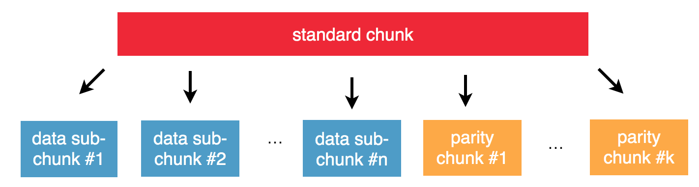

============
Data Storage
============

.. contents::
   :local:

Storage policies
----------------
Storage policies are OpenIO’s way of managing storage tiering. They consist of triplets describing constraints set by the requestor: which storage class is to be used (the kind of device with its fallback, i.e., fast SSD, SAS drive, tape, etc.); how data is to be protected (simple replication or sophisticated erasure encoding); whether data is to be processed (compressed, encrypted, etc.).
All possible storage policies are namespace-wide, with default configurations that can be changed on the fly. These defaults can be overridden on a per-container basis.

Versioning
----------
A container can keep several versions of an object. This is configured at the container level, for all objects it contains. The setting is activated when the container is created or during the container’s life.
When versioning is disabled, pushing a new version of an object overwrites the former version, and deleting an object marks it for removal. When versioning is enabled, pushing an object creates a new version of the object. Previous versions of an object can be listed and restored.
The semantics of object versioning has been designed to be compliant with both Amazon S3 and Swift APIs.

Compression
-----------
Applied to chunks of data, compression reduces overall storage cost. Data is decompressed on the fly during chunk download, with an acceptable extra latency and CPU usage. Compression is usually an asynchronous job to avoid performance impact, and is a selective process  (i.e, by age, mime-type, user, etc.).

Directory replication
---------------------
Configurable at each level of the architecture, directory replication secures namespace integrity. Service directory and container metadata can be synchronously replicated on other nodes.

Data protection
---------------
Data protection is flexible, starting from a simple, multiple-copy mechanism, up to erasure coding, allowing users to chose the appropriate option for their needs, both in terms of protection and efficiency.
Dynamic data protection policies are also available. They allow the system to automatically select the best data protection mechanism after looking at the characteristics of the stored object, associating optimal efficiency and data protection for each object stored in the system.

Replication
^^^^^^^^^^^
TODO

Container replication is performed using the same mechanism as the Service Directory replication. Each container has its own replication cluster. The participating container servers are selected when the container is created. This selection is done respecting specific service distance constraints.

Object replication is performed at the chunk level. At the time of object upload, chunks are uploaded by the client on the chunk servers in parallel. If one of the chunk servers fails during this operation, the object upload can continue while the replication quorum is respected.

Erasure Coding
^^^^^^^^^^^^^^

TODO Schema à modifier

OpenIO internally uses the liberasurecode and allows the administrator to configure the algorithm and its K and M parameters.

+ Uses much less disk space, depending on your K and M
+ Parallelize the reads and the writes
+ Immediately informs the reader that the data has been corrupted
- Keeps K+M open sockets for each read/write operation
- Consumes CPU for both reading and writing
- Raw chunks cannot be used as-is

Self-healing / Integrity loop
-----------------------------
Each directory has a counterpart, that is reversed; i.e., each item knows its parents. A container is aware of its account, and a chunk is aware of the object and the ID of the container it belongs to. This makes it possible to rebuild a directory with a simple crawl of the items present on the storage nodes. Even if a container is lost, it is still possible to reconstruct it directly from the data. Usually, containers are replicated and rebuilt without the need for a reverse directory crawl.
Storage nodes are also periodically crawled to trigger actions on each item (e.g. integrity checks, or chunk accessibility).
All those administrative tasks are accessible through REST APIs, so that it is easy to perform on-demand maintenance actions.

.. image:: ../../../images/openio-arch-intigrity-loop.png
   :width: 800 px
