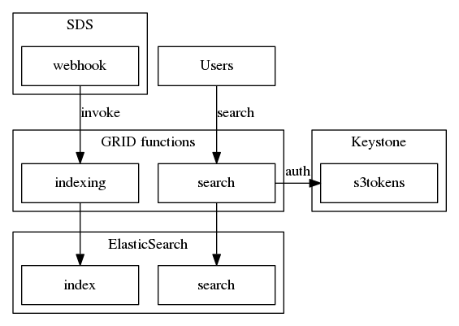

=================
Metadata Indexing
=================

.. contents::
   :depth: 1
   :local:

Description
+++++++++++

OpenIO SDS can be configured to index all objects metadata in an external ElasticSearch.

- All object metadata are accessible for search requests using ElasticSearch API
- Metadata search allow retrieving objects matching certain criteria (for example: search PNG images less than 2MB created last month).
- Custom user metadata are also supported.

Details
+++++++

Indexing
--------

Indexing of object metadata is performed via a grid function `indexing`.
On OpenIO SDS, all actions on objects invoke the `indexing` function which manage an elasticsearch index.

The ``oio-event-agent`` component, responsible for processing events is configured to invoke, via the `webhook` filter, the indexing function.
During the invocation, the `webhook` filter is responsible for formatting and retrieving all the information needed to index the metadata of the object.

Here are the default SDS metadata automatically indexed:

- *account* account name
- *user* user name
- *path* object name
- *ns* namespace name
- *hash* object hash
- *mime-type* object mime-type
- *size* object size _integer_
- *version* object version _integer_
- *ctime* object creation time _unix timestamp_
- *mtime* object modification time _unix timestamp_
- *id* object id
- *chunk-method* object chunk method
- *policy* object storage policy
- *deleted* object deleted flag _integer_

**Misc**

- one sds account = one elasticsearch index
- Objects metadata also include user metadata
- A default mapping is specified globally for the namespace, value can be overriden by account

Search
------

Users can search the indexed metadata of an account.

Elasticsearch API is protected using aws credentials (AWSv4 auth).
A `search` grid function is used to authenticate user requests to elastisearch by checking credentials via Keystone.
It also checks if the user is the owner of the index.

Architecture diagram
++++++++++++++++++++

