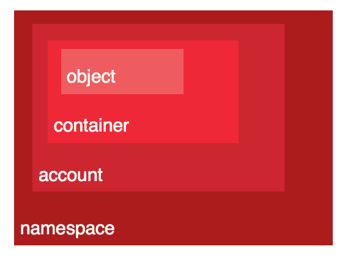
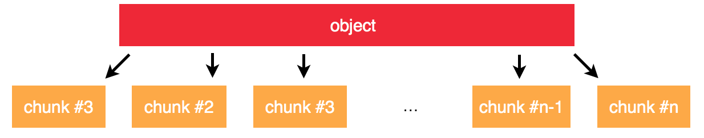
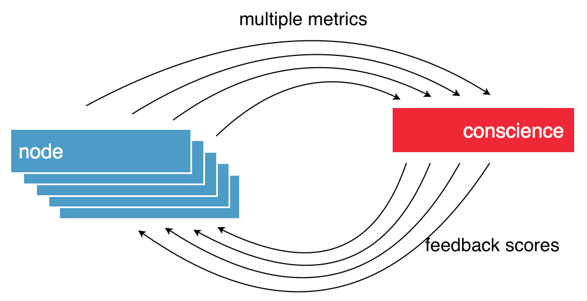
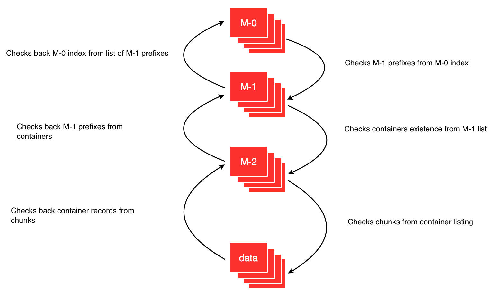
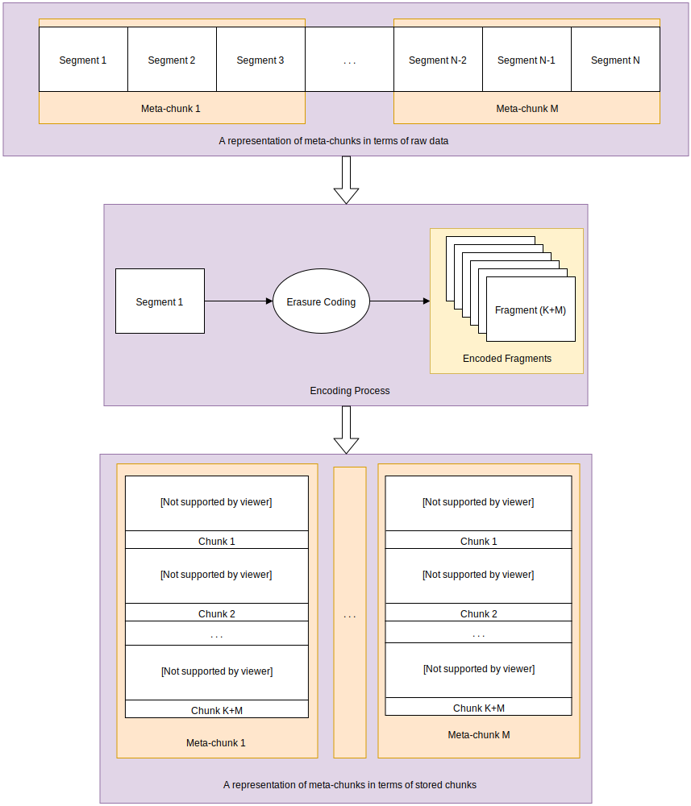

.. title:: Core concept of OpenIO SDS

.. _ref-solution-core-concepts:

=========================
OpenIO SDS: Core Concepts
=========================

.. contents::
   :local:

Data organisation
~~~~~~~~~~~~~~~~~

Namespace
---------

A coherent set of network services working together to run OpenIO's solutions.

Account
-------
This usually represents a customer, and there is no limit to the number
of accounts in a namespace. Accounts keep track of namespace usage for each
customer (i.e. the list of containers and the number of bytes occupied by all
of a customer’s objects).

Containers
----------
These are object buckets, and they keep track of object locations.
A container belongs to one (and only one) account.

Objects
-------
The smallest data units visible by customers. An object belongs
to one (and only one) container.

Chunks
------
Parts of objects, not visible by customers. They are limited in size.
They can be replicated or be accompanied by parity chunks.

Versioning
----------
A container can keep several versions of an object. This is configured at
the container level, for all objects it contains. The setting is activated
when the container is created or during the container’s life.

When versioning is disabled, pushing a new version of an object overwrites the
former version, and deleting an object marks it for removal. When versioning
is enabled, pushing an object creates a new version of the object. Previous
versions of an object can be listed and restored.

The semantics of object versioning has been designed to be compliant with
both Amazon S3 and Swift APIs.

No SPOF
~~~~~~~~
Each service used to serve data is redundant. From the top level of
the directory to the chunk of data stored on disk, all information is
duplicated. There is no SPOF (single point of failure): a node can be shut
down, and it will not affect overall integrity or availability.

Container & Chunk Isolation
~~~~~~~~~~~~~~~~~~~~~~~~~~~
Each container is stored in a separate file (i.e. not all in one unique data
structure), and each chunk is also stored as a file. This greatly improves
the overall robustness of the solution and limits the impact of corruption
or the loss of a single item.

Massively Distributed Three-Level Directory
~~~~~~~~~~~~~~~~~~~~~~~~~~~~~~~~~~~~~~~~~~~
Containers and objects are stored in a persistent three-level distributed directory (Meta-0, Meta-1, Meta-2). OpenIO SDS can store hundred of services for each of hundred of millions of containers, with strong consistency and low latency, especially for read operations.
The directory has the form of a hash table, mapping containers’ UUIDs to their services. To handle a large number of items, a first level of indirection splits the hash table into 64k slots. Every level is synchronously replicated.
Higher levels of the directory (indirection tables) are particularly stable, and benefit from cache mechanisms in place. Caches are implemented everywhere, especially inside directory gateways, and are also available on the client side.

.. image:: ../../../images/openio-arch-directory-indirection-tables.png
   :width: 600 px
   :align: center

References
----------
References are named groups of service links.
Internally, their names are hashed to a 64 bytes hexadecimal string.
References are managed by the second level of the service directory (Meta1).

Prefixes
--------
Prefixes are the first bytes of hashed reference names. They are used
to shard the references on the first level of the service directory (Meta0).
In the current implementation, prefixes are 16 bits long, so there are exactly
65,536 of them.

Directory Replication
---------------------
Configurable at each level of the architecture, directory replication
secures namespace integrity. Service directory and container metadata can
be synchronously replicated on other nodes.

Each prefix has its own replication cluster. When the prefix is created,
the replication cluster is created, and the participating directory servers are
selected. Each replication cluster has a single master and a set of slaves:
the master manages write operations and replicates them to its slaves.
A write operation is considered successful when the replication quorum is
respected. Note that slaves can also perform reads if requested.

Transient failures like network partitions can cause replicas to diverge, but with this
replication mechanism differences are reconciled automatically.

.. _label-arch-conscience:

Conscience: Dynamic Load-Balancing
~~~~~~~~~~~~~~~~~~~~~~~~~~~~~~~~~~
For data placement, OpenIO SDS provides a system called Conscience, responsible for efficiently matching requests and services. Conscience takes into account constraints set by the request (i.e. respect of storage policies) and computes a quality score between 0 and 100 for each service available in the cluster. These quality scores are based on an algorithm that aggregates data provided by a number of sensors on the various nodes of the grid. Through this feedback loop, each node knows in real time which are the best nodes with the highest scores to handle subsequent requests.

A score of 0 indicates the service must be avoided. A positive score means the service can be used; the higher it is, the better its performance will be.

Reverse directory
~~~~~~~~~~~~~~~~~
The rdir services keep track of all chunks stored on each rawx service.
When a rawx is broken, admins can rebuild lost chunks thanks to rdir information,
as long as each chunk is duplicated.
When a chunk is uploaded to a rawx (or deleted), this rawx sends an event to
the event agent, which updates rdir information.

For each chunk, rdir stores:

- mtime: the date of the last update of this entry (when a chunk is uploaded to a rawx).
- rtime: the date of the rebuild, if any.
- the id of the object the chunk belongs to.

If the volume has no associated rdir, an rdir will be automatically associated to
it. The Meta1 directory stores this association using the special account **_RDIR**.

Metadata Proxy
~~~~~~~~~~~~~~
Whichever protocol is in used by internal services (directories), all clients rely on a layer of gateways that provides a simple REST API for metadata accesses. This API provides high-level operations that encapsulate all the underlying logic behind the management of accounts, containers, and their contents. Gateways are also the ideal place for shared cache mechanisms, similar to the way name service cache daemon works on Linux hosts.

.. image:: ../../../images/openio-client-with-proxy.svg
   :width: 400 px
   :align: center

Self-Healing / Integrity Loop
~~~~~~~~~~~~~~~~~~~~~~~~~~~~~
Each directory has a counterpart that is reversed; i.e., each item knows
its parents. A container is aware of its account, and a chunk is aware of the
object and the ID of the container it belongs to. This makes it possible to
rebuild a directory with a simple crawl of the items present on the storage
nodes. Even if a container is lost, it is still possible to reconstruct
it directly from the data. Usually, containers are replicated and rebuilt
without the need for a reverse directory crawl.

Storage nodes are also periodically crawled to trigger actions on each item
(e.g. integrity checks, or chunk accessibility).

All these administrative tasks are accessible through REST APIs, so it
is easy to perform on-demand maintenance actions.

Erasure Coding
~~~~~~~~~~~~~~

OpenIO internally uses liberasurecode and allows the administrator to
configure the algorithm and its K and M parameters. There are several advantages to this:

+ It uses much less disk space, depending on your K and M.
+	Reads and writes are parallelized.
+	It immediately informs the user if data has been corrupted.

On the other hand, there are some disadvantages:

- It keeps K+M sockets open for each read/write operation.
-	It consumes CPU for both reading and writing.
-	Raw chunks cannot be used as is.

Replication
~~~~~~~~~~~

Container replication is performed using the same mechanism as service
directory replication. Each container has its own replication cluster.
The participating container servers are selected when the container is
created, and specific service distance constraints are respected.

Object replication is performed at the chunk level. At the time of object
upload, chunks are uploaded by the client to the chunk servers in parallel. If
one of the chunk servers fails during this operation, the object upload can
continue while the replication quorum is respected.

Isolation
---------
Each container is stored in a separate file (i.e. not in one unique data
structure), and each chunk is also stored as a file. This greatly improves
the overall robustness of the solution and limits the impact of corruption
or the loss of a single item.

Multi-Tenancy
-------------
Multi-tenancy is a core element of OpenIO SDS. Data is organized in two
main levels: the account and the container. Data objects are stored using the
following hierarchy: namespace/account/container/object. Multiple namespaces
can be configured in each cluster, providing multi-region/zone logical
layouts for applications and segregated workloads depending on tenant or
data geo-distribution needs. There is no classic subdirectory tree. Objects
are stored in a flat structure at the container level. As with many other
object storage solutions, it is possible to emulate a filesystem tree,
but it has no physical reality.
