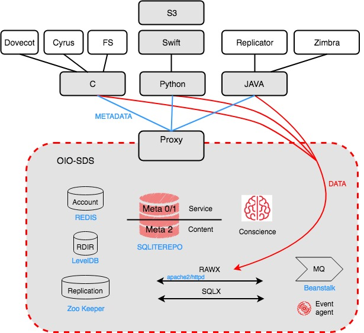

========
Services
========

Introduction
~~~~~~~~~~~~

OpenIO SDS solution is composed of multiple services, running on commodity hardware, from power efficient systems to high performance servers.
Services are designed to run across multiple nodes and do not require any specific collocation.

Here are a view of the different services available :

Front stack
~~~~~~~~~~~

OpenIO Swift
------------

The OpenIO Swift service handles Swift/S3 user requests.

Key characteristics :

- Stateless
- CPU and network intensive

Openstack Keystone
------------------

User authentication and service discovery is done through Openstack Keystone which is accessed directly by the client when using the Swift API, whereas when using S3, Keystone does not need to be publicly exposed.

Key characteristics :

- Stateless
- CPU intensive

MySQL
-----

MySQL is used as a backend for Openstack Keystone.

Key characteristics :

- Stateful
- CPU and network intensive
- Recommanded to be deployed as cluster using MariaDB Galera cluster on at least 3 different servers.

OpenIO SDS
~~~~~~~~~~

OpenIO SDS core solution is divided in multiple simple and lightweight services, which can be easily distributed on different nodes:

- conscience services
- directory services
- data services
- event services
- account services

Conscience services
-------------------
Conscience services are composed of a conscience service and conscience-agent services.

**Conscience**

The conscience service has two main functions:

- Service Discovery : To find other services available in the namespace, a service uses the Conscience to discover what kind of services are available and how to contact them.
- Load Balancing : the Conscience performs load balancing using real time metrics that are collected from the storage nodes. A score between 0 and 100 is computed using a configurable formula and then used to do a weighted random selection

Key characteristics :

- Stateless
- CPU and network intensive
- Must be deployed on at least 3 different servers

**Conscience-agent**

This service monitore local services on the machine and also manage service registration in the conscience.

Key characteristics :

- Stateless
- Must be deployed on each server

Directory services
------------------
Directory services (all the meta0, meta1 and meta2 services), are responsible for handling directory requests and store metadata.
All of the directory services are replicated.

**META0**

The meta0 directory stores for each container his meta1 adress.
Meta0 handles a very limited and static number of entries (65,536).
There is only one instance of meta0 per namespace.

Key characteristics :

- Stateful
- Very limited and static entries
- CPU and network intensive
- Must be deployed on 3 different servers
- Recommanded to be deployed on high performance storage like SSD or NVMe

**META1**

The meta1 directory stores for each container his meta2 adress.
The meta1 can manage several million of container.

Key characteristics :

- Stateful
- CPU and network intensive
- Must be deployed on at least 3 different servers
- Recommanded to be deployed on high performance storage like SSD or NVMe

**META2**

The meta2 directory stores for each container the content list and for each content their chunks adresses.

Key characteristics :

- Stateful
- CPU, IO and network intensive
- Must be deployed on at least 3 different servers
- Recommanded to be deployed on high performance storage like SSD or NVMe

**Zookeeper**

This service is used to store the directory services election statuses.

Key characteristics :

- Stateless
- Need a quite high volume of RAM

**Metadata-proxy**

The metadata-proxy service is a HTTP directory proxy to easily requests conscience/meta0/meta1 and meta2 services through a simple HTTP REST API.

Key characteristics :

- Stateless
- CPU intensive

Data Services
-------------

Data services are services responsible of storing and serving the data like the rawx, handling part of the metadata depending on it like the rdir and the oio-blob-indexer.

**Rawx**

The RAWX service is a share-nothing service responsible to store the chunks. The interface uses a subset of the WebDAV commands augmented with custom headers.

Key characteristics :

- Stateless
- IO intensive
- Must be deployed on every disks of the platform

**Rdir**

Rdir is a reverse directory which stores chuncks references of a rawx. This service is useful to rebuild a rawx.

Each rawx has a Rdir instance associated which is not hosted on the same server.

Key characteristics :

- Stateful
- IO intensive
- Must be deployed on every disks of the platform

**oio-blob-indexer**

oio-blob-indexer is a crawler which re-index chuncks in the Rdir

Key characteristics :

- Stateless
- IO intensive
- Must be deployed on every disks of the platform

**ECD**

ECD (Erasure Coding Daemon) is used to manage Erasure Coding threw C and Java SDKs

Key characteristics :

- Stateless
- CPU intensive
- Must be deployed on every servers  of the platform

Event services
--------------

Event services are services that handle asynchronous jobs, they are composed of the event-agent which relies on a beanstalkd backend to manage jobs.

**Event-Agent**

Key characteristics :

- Stateless
- CPU intensive
- Must be deployed on every disks of the platform

**Beanstalk**

Key characteristics :

- Stateful
- IO intensive
- Recommanded to be deployed on high performance storage like SSD or NVMe

Account management
------------------

**Account**

The account service stores account related information such as the containers list, the number of objects and the number of bytes occupied by all objects.
Following an operation on a container (PUT, DELETE), events are created and consume by the account service in order to update the account information asynchronously.

Key characteristics :

- Stateless
- CPU intensive

**REDIS**

Redis is used by the account service to store the accounts information.

Key characteristics :

- Stateful
- IO intensive
- Recommanded to be deployed on high performance storage like SSD or NVMe

Other Services
~~~~~~~~~~~~~~

Replicator
----------
The replicator service is a work queue consumer process. It’s main purpose is to asynchronously replicate objects and container from one local namespace to another geographically distant namespace.

Key characteristics :

- Stateless

Charge Back
-----------
Charge back is an Http service allowing to retrieve the following information for an account, useful for billing :

- number of bytes
- number of objects
- incoming bandwidth
- outgoing bandwidth
- details of selected containers

Key characteristics :

- Stateless

WebUI
-----
TODO
