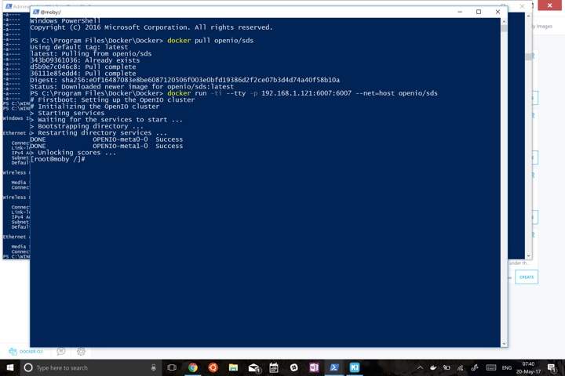
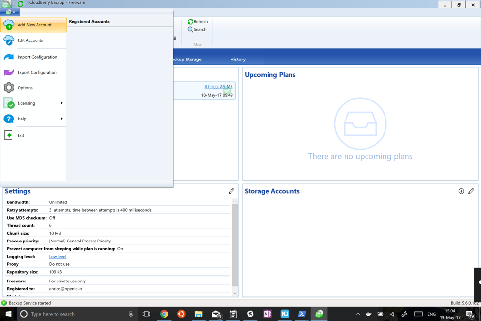
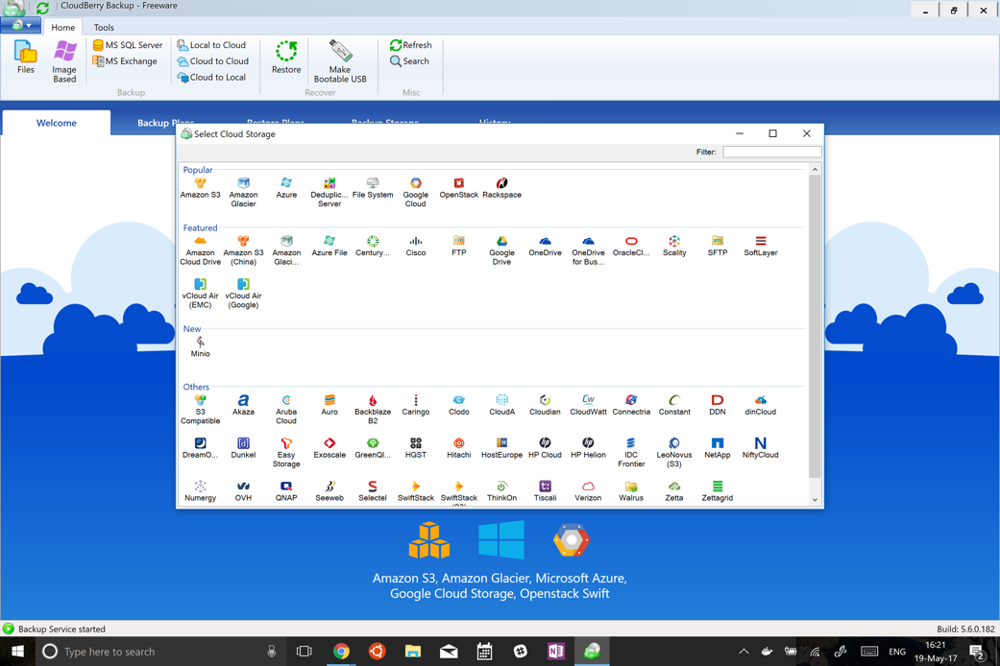
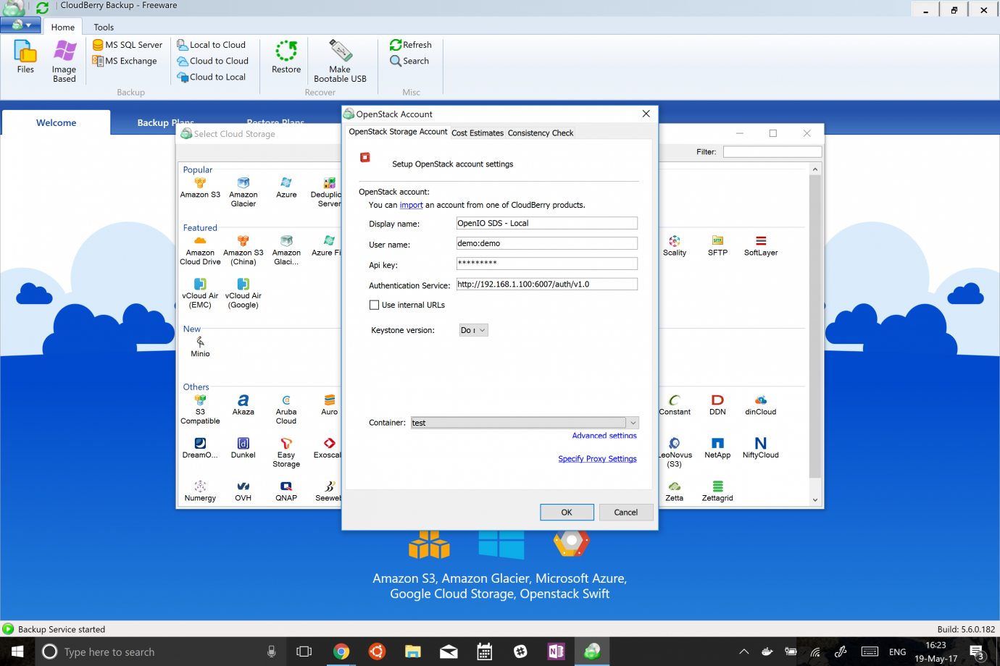
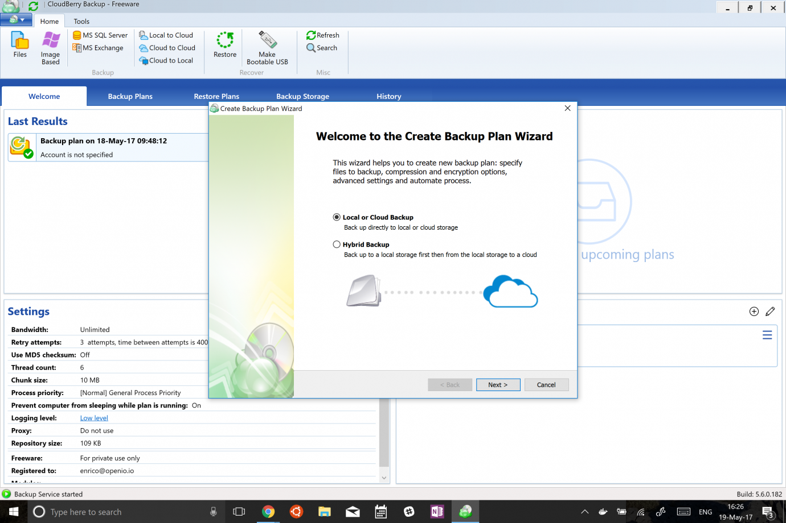
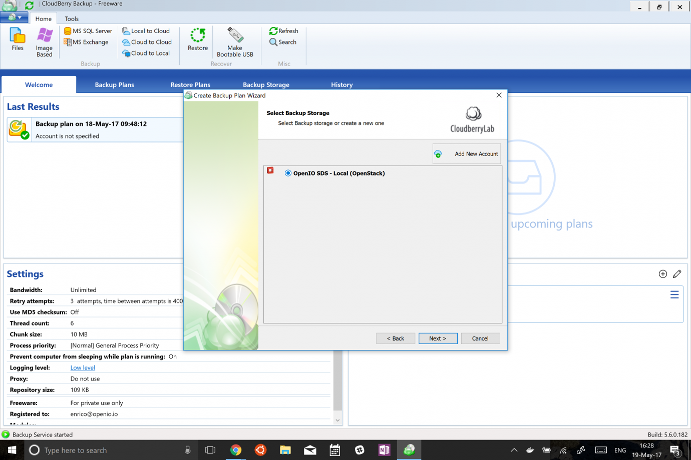
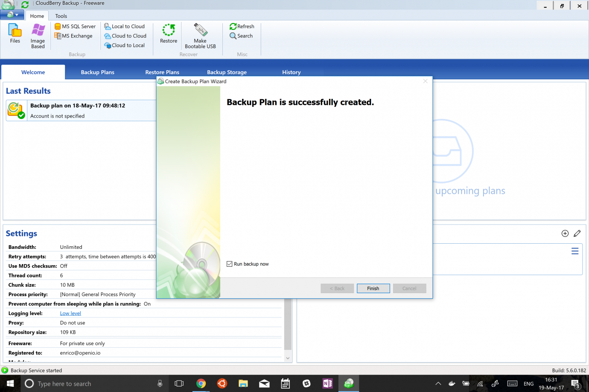
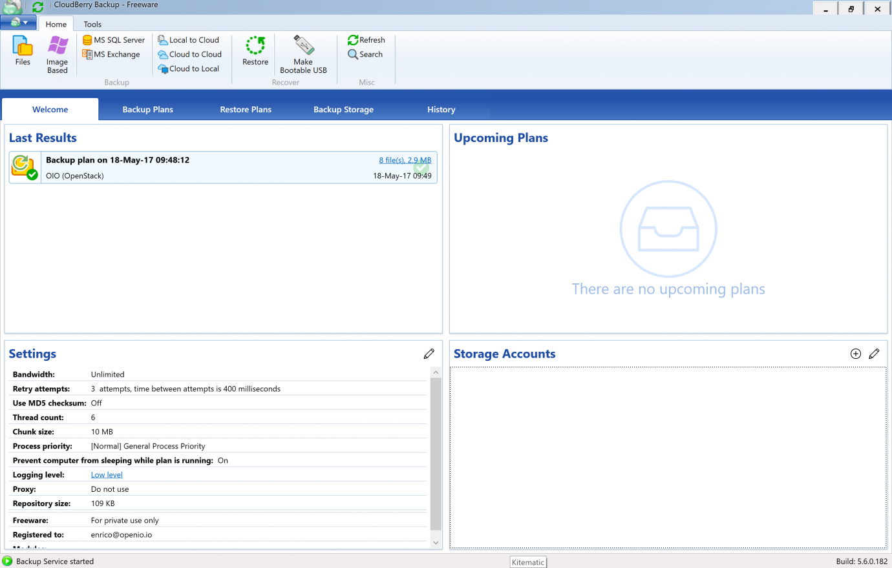

.. title:: Integrate CloudBerry Backup with on premise S3 object storage.

.. _ref-use-case-cloudberry:

=================
Cloudberry Backup
=================

`CloudBerry Backup <https://www.cloudberrylab.com/backup.aspx>`_ exists in several forms, from a simple and straightforward free version to a complete solution for managed backups designed for service providers.

This document explains how to install the product on a Windows PC and configure it to work with an SDS instance.

Prerequisites
-------------

This procedure was tested on a PC with Microsoft Windows 10 and, just to simplify things, I’ll use a Docker container to deploy OpenIO SDS (it also works the same way on a Raspberry Pi).

The OpenIO SDS container is available on Docker Hub, and the procedure to get it up and running is very simple.

The first prerequisite is to have Docker on your PC. If you don’t have it, you can download and install the package from here_. Once the package is installed, Docker launches automatically.

.. _here: http://www.docker.com/

For this example, and to keep things simple, I’ll use the Swift protocol and TempAuth authentication system with the default credentials that are preset in the standard installation: demo:demo user and PASS_DEMO password.

Installation
------------

Open a Powershell CLI (you’ll find this in the menu that appears when you right-click the Start menu).
At the prompt, type:

.. code-block:: text

  $docker pull openio/sds

Followed by

.. code-block:: text

  $docker run -ti --tty -p 192.168.1.121:6007:6007 --net=host openio/sds

These commands download the container image, if it is not available on the system, and launch it with specific options. The container is not usually visible to the rest of the world, but Docker provides a NAT service, which is why we use the –p option. It maps TCP port 6007, accessible only on a private network, to the same port in the external world. The IP address is the IP of my default interface (my_ip:int_port:ext_port).
At this point, OpenIO SDS is up and running, and the Swift service is available on port 6007 of the local network from your PC. Remember to configure your Windows Firewall to make it accessible from other devices on your network.

Configuration
-------------
You can download Cloudberry Backup directly from CloudBerry Lab’s website; here’s the link_. The installation process is straightforward, and a wizard walks you through the necessary steps.

.. _link: https://www.cloudberrylab.com/backup/windows.aspx

Once it is installed, you have to configure access to the object store. To do this, select “Add New Account” from the first menu on the left.

A new window appears:

Click the OpenStack Icon and fill in the fields in the dialog box as follows:

Note that you have to select a container or create a new one; otherwise it won’t work.

Click OK, and the system is ready.
Click the File menu and you’ll be prompted with the Create Backup Plan wizard.

A few more steps and you’re done:

Select the account you created earlier, then click Next.
Give the plan a name, select what you want to back up, how, when, etc., and, in the last window, check Run Backup Now.

After you click Finish, the backup will start.

