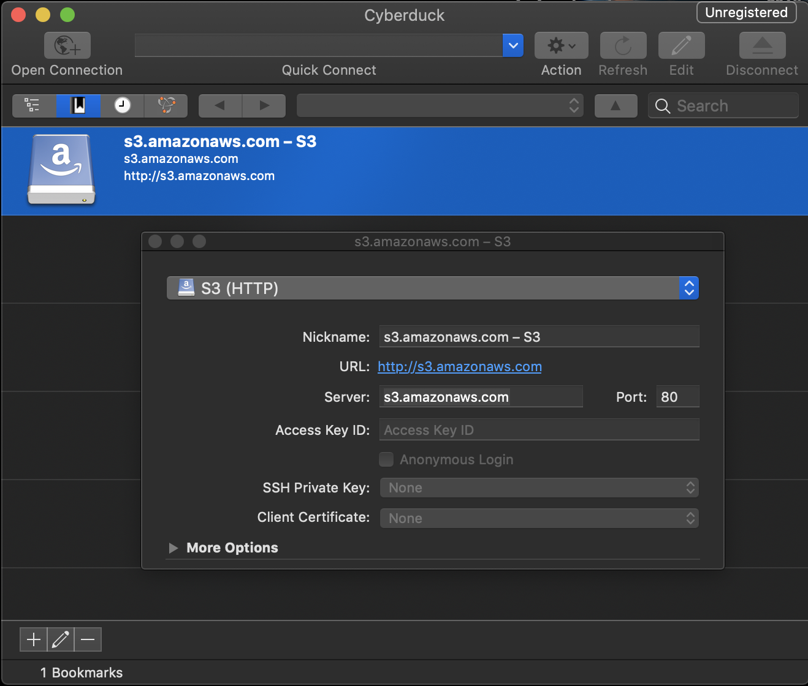
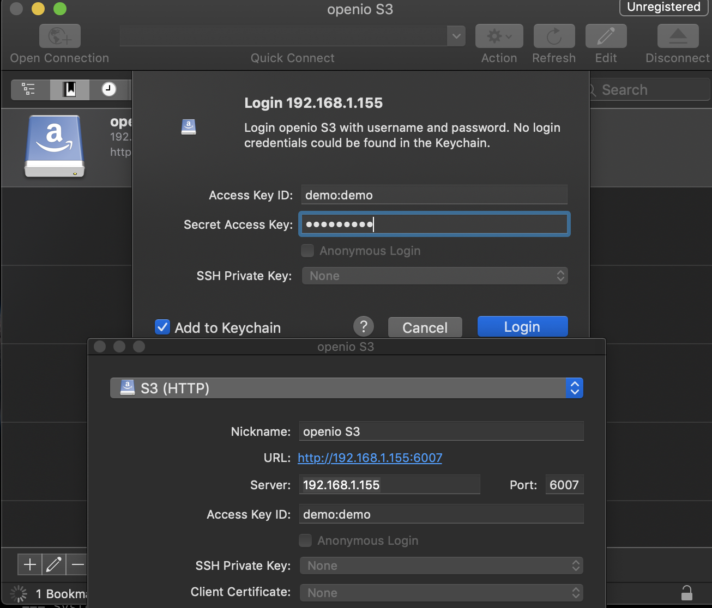
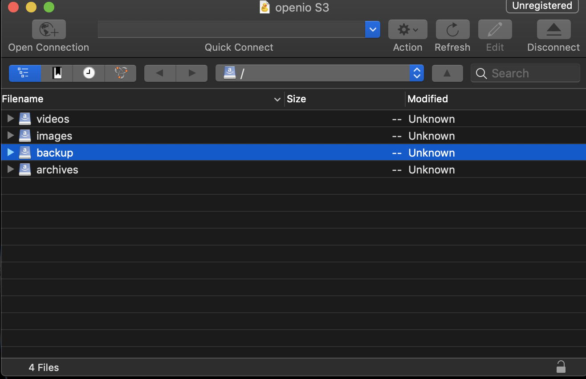
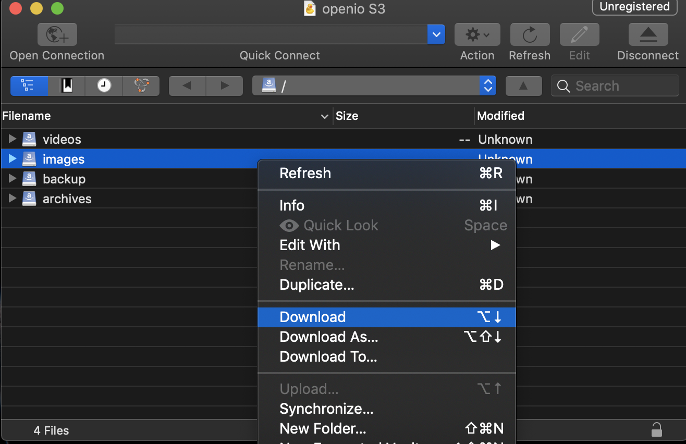
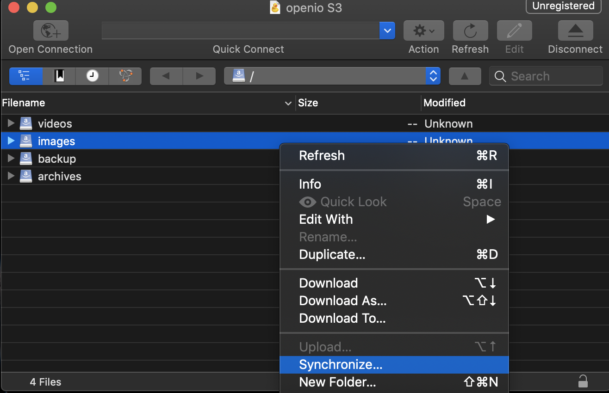
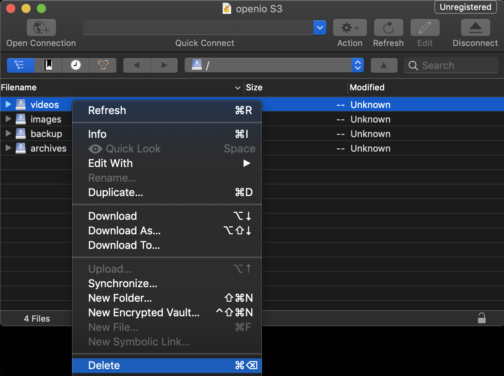

.. _ref-use-case-cyberduck:

Cyberduck
=========

In this document you will learn how to carry out basic operations on OpenIO using Cyberduck.
Cyberduck is an open source client for FTP and SFTP, WebDAV, OpenStack Swift, and Amazon S3, available for MacOS and Windows.
It is released under the GPL license v2.0.

This guide will explain how to setup this client to use OpenIO.

1. Prerequisites
----------------

-  `Cyberduck <https://cyberduck.io/>`__ is installed and running. Download a generic ``HTTP`` S3 profile from `here <https://svn.cyberduck.io/trunk/profiles/S3%20(HTTP).cyberduckprofile>`__.

-  OpenIO cluster is running on any ``oioswift`` node at port 6007 in ``HTTP``, follow `Multi Nodes Installation <https://docs.openio.io/latest/source/sandbox-guide/multi_nodes_install.html>`__ guide for installing OpenIO.

.. code-block:: console
   :caption: result of check.sh

    
    AWS S3 summary:
      endpoint: http://192.168.1.155:6007
      region: us-east-1
      access key: demo:demo
      secret key: DEMO_PASS
      ssl: false
      signature_version: s3v4
      path style: true

2. Steps
--------

Add S3 authentication in Cyberduck
~~~~~~~~~~~~~~~~~~~~~~~~~~~~~~~~~~

Click open connection, select ``HTTP``

Replace the existing AWS S3 details with your OpenIO credentials
~~~~~~~~~~~~~~~~~~~~~~~~~~~~~~~~~~~~~~~~~~~~~~~~~~~~~~~~~~~~~~~~

Click on the connect tab to establish connection
~~~~~~~~~~~~~~~~~~~~~~~~~~~~~~~~~~~~~~~~~~~~~~~~

Once the connection is established you can explore further, some of the operations are listed below.

List Bucket
^^^^^^^^^^^

Download bucket
^^^^^^^^^^^^^^^

Mirror Bucket
^^^^^^^^^^^^^

Delete Bucket
^^^^^^^^^^^^^

3. Explore Further
------------------

-  `OpenIO complete documentation <https://docs.openio.io>`__
-  `Cyberduck project homepage <https://cyberduck.io>`__
