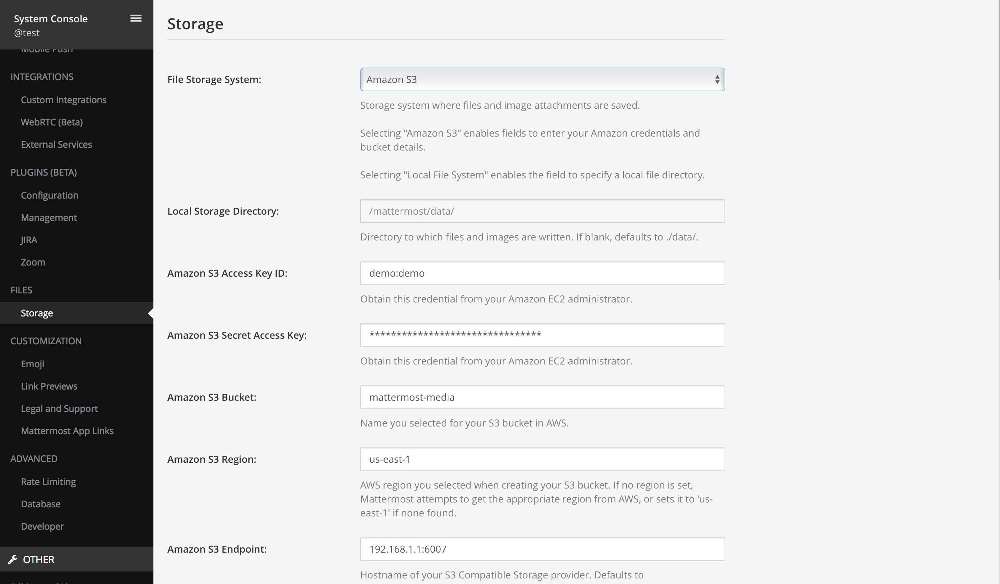

==========
Mattermost
==========

Description
-----------

Mattermost is a suite of client-server software for creating and using chat and file sharing services.
It is functionally similar to Slack, although Mattermost is open-source, <https://mattermost.com>
allowing anyone to install and operate it on a private server.

This guide will explain how to setup storage in Mattermost to use OpenIO.

Prerequisites
-------------

In the present guide, we expect **Mattermost** to be installed.

It also expects that you have configured access to an OpenIO cluster with the S3 gateway.
You must know your S3 credentials (access_key and secret_access_key) and the S3 endpoint URL.

Use these values with the openio/sds docker container and the 3 nodes deployment:

* Endpoint URL (http://localhost:6007)
* Access key (demo:demo)
* Secret access key (DEMO_PASS)
* Region us-east-1

Please `contact us <https://info.openio.io/request-information>`_ for additional information
about our preferred S3 setup.

*********************
Storage Configuration
*********************

Via the Mattermost WebUI (admin rights required):

- go to the "System console"
- on the left panel select "FILES - Storage"
- change "File Storage System" from "Local File System" to "Amazon S3"
- fill the Access key, Secret key, Bucket, Region, Endpoint and deactivate SSL if you dont use it on OpenIO. 

Mattermost doesn't create the bucket automatically so you will have to create it by using awscli with a cmd like
.. code-block:: console
    aws --endpoint-url http://127.0.0.1:6007 --no-verify-ssl s3 mb s3://mattermost-media

