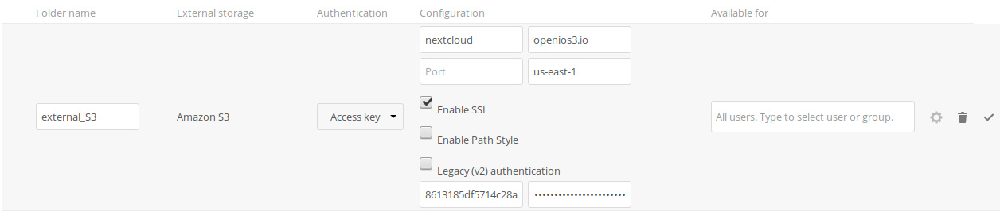

=========
Nextcloud
=========

Description
-----------

Nextcloud is a suite of client-server software for creating and using file hosting services.
It is functionally similar to Dropbox, although Nextcloud is free and open-source,
allowing anyone to install and operate it on a private server.

This guide will explain how to setup storage in Nextcloud to use OpenIO.

Prerequisites
-------------

In the present guide, we expect **Nextcloud** to be installed.

It also expects that you have configured access to an OpenIO cluster with the S3 gateway.
You must know your S3 credentials (access_key and secret_access_key) and the S3 endpoint URL.

Use these values with the openio/sds docker container:

* Endpoint URL (http://localhost:6007)
* Access key (demo:demo)
* Secret access key (DEMO_PASS)
* legacy auth true

Please `contact us <https://info.openio.io/request-information>`_ for additional information
about our preferred S3 setup.

Configuration using CLI
-----------------------

First, the External Storage application must be enabled:

.. code-block:: console

   $ php occ app:enable files_external
   files_external enabled

Check S3 is supported on your installation:

.. code-block:: console

   $ php occ files_external:backends storage amazons3
     - name: Amazon S3
     - identifier: amazons3
     - configuration:
       - bucket: text
       - hostname: text
       - port: text
       - region: text
       - use_ssl: boolean
       - use_path_style: boolean
       - legacy_auth: boolean
     - storage_class: \OCA\Files_External\Lib\Storage\AmazonS3
     - supported_authentication_backends:
       - amazons3::accesskey
     - authentication_configuration:
       - amazons3::accesskey:
         - key: text
         - secret: password

Mount your S3 bucket on Nextcloud as external_S3 mountpoint:

.. code-block:: console

   $ php occ files_external:create -c bucket=nextcloud \
                                   -c hostname=openios3.io \
                                   -c region=us-east-1 \
                                   -c use_ssl=true \
                                   -c use_path_style=true \
                                   -c legacy_auth: false \
                                   -c key=8613185df5714c28aaea33a019c2d377 \
                                   -c secret=3de38bd9a2e24e54adc6698bedd3c08c \
                                   external_S3 amazons3 amazons3::accesskey
   Storage created with id 7

Validate your parameters:

.. code-block:: console

   $ php occ files_external:verify 7
     - status: ok
     - code: 0
     - message

Check and update if needed parameters:

.. code-block:: console

   $ php occ files_external:list
     +----------+--------------+-----------+---------------------+-----------------+---------+------------------+-------------------+
     | Mount ID | Mount Point  | Storage   | Authentication Type | Configuration   | Options | Applicable Users | Applicable Groups |
     +----------+--------------+-----------+---------------------+-----------------+---------+------------------+-------------------+
     | 7        | /external_S3 | Amazon S3 | Access key          | bucket: "nex... |         | All              |                   |
     +----------+--------------+-----------+---------------------+-----------------+---------+------------------+-------------------+

   $ php occ files_external:config 7 bucket newbucket

Launch indexation of new storage:

.. code-block:: console

   $ php occ files:scan -vvv --path /admin/files/external_S3
   Starting scan for user 1 out of 1 (admin)
        Folder /admin/files/external_S3/
        Folder /admin/files/external_S3/Air
        ...
   +---------+-------+--------------+
   | Folders | Files | Elapsed time |
   +---------+-------+--------------+
   | 3       | 13    | 00:00:04     |
   +---------+-------+--------------+

Configuration using GUI
-----------------------

You have to add External Storage App:

- Click on the upper right corner
- Click Apps
- Select Not Enabled entry
- Locate External Storage and click on Enable button

Configure External Storage App:

- Click on the upper right corner
- Click on Settings
- Select External App on the left
- Enter Folder name (external_S3
- Select Amazon S3 as External Storage
- Fill fields according to your configuration:

If there is any error, you will need to check Nextcloud log.

Note
----

This procedure was tested with Nextcloud 13
